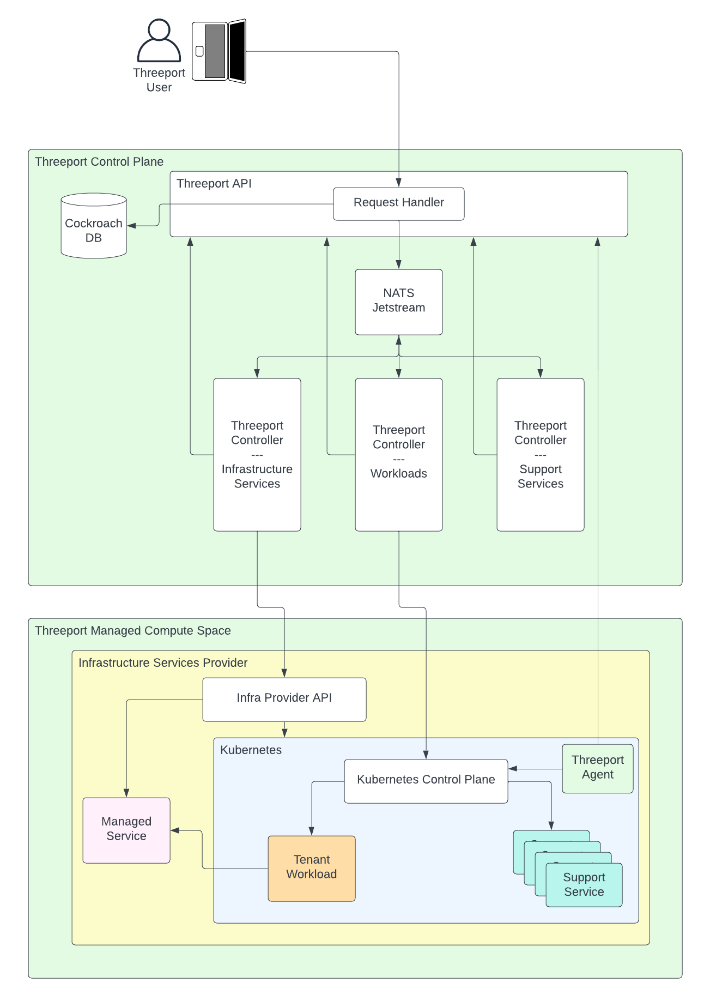
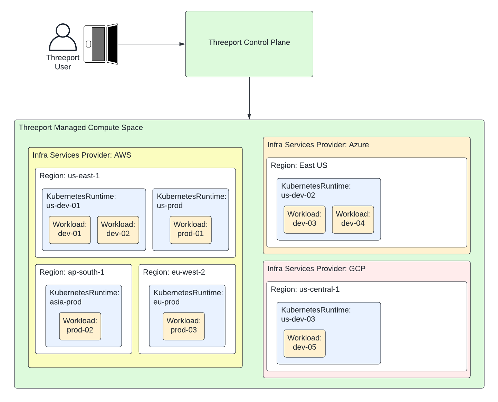
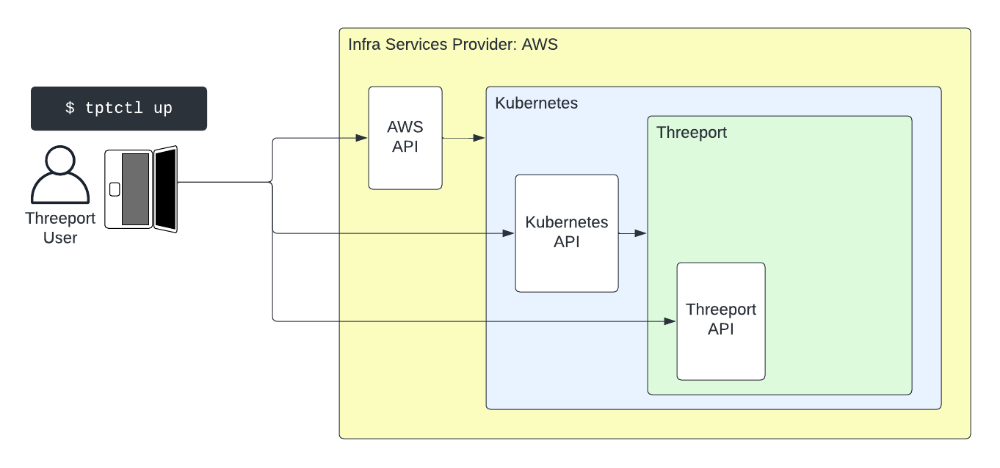

# Architecture Overview

Threeport is a distributed software system that performs application
orchestration.  It serves as a unified, global control plane for all cloud
infrastructure, compute environments and the applications that run there.

Users interface with the Threeport RESTful API in the control plane.
In response to user requests, Threeport interfaces with infrastructure,
managed service provider and Kubernetes APIs on the user's behalf.  It
orchestrates the delivery of software with all of its dependencies.  Those
dependencies encompass everything from the cloud infrastructure up to the
services needed for the application to run successfully.

## Foundational Principles

Threeport is designed and built upon the following principles:

* General purpose programming languages like Go are superior to DSLs and
  templates for defining the behavior of complex systems.
* Git repos are not great for storing the configuration of complex systems.  For
  a system that is driven by software controllers, a database is more efficient
  for both reads and writes by those controllers.
* Use progressive disclosure in the abstractions available to users.  Dead
  simple use cases should be trivial to configure and execute.  However, complex
  use cases should be supported by allowing users greater level of
  configurability in the underlying systems when needed.

## Control Plane

The diagram below illustrates the Threeport control plane in a little more
detail.  The control plane consists primarily of:

* A RESTful API
* A relational database: CockroachDB
* A controller notification broker: NATS Jetstream
* A number of controllers that each manage a specific domain of concerns and
  reconcile state for specific objects in the system, such as Workloads,
  KubernetesRuntimes and support services such as Gateways and DomainNames.
* An agent that runs in the Kubernetes environments to report back on the status
  of workloads running there.

> Note: the controllers in the diagram below are just abstract examples.  For a
> complete list of the actual controllers in the Threeport control plane, see
> the [Control Plane architecture](control-plane.md) docs.

This diagram illustrates the following process:

1. The Threeport user sends a request to the Threeport API.  This is usually
   done with the Threeport CLI, `tptctl` but can be made by anything that can
   make a call to a RESTful API.  This request might be for a new Kubernetes
   environment or for an application deployment into that environment.
1. A request handler in the Threeport API persists the desired state from the
   user in the Threeport database which is CockroachDB.  Once the desired state
   is persisted, the request handler sends a notification to the appropriate
   controller/s through NATS Jetstream.
1. If the request requires some compute infrastructure and/or managed services,
   the controller responsible for infrastructure services connects to the Infra
   Provider API to manage that.
1. If the requests requires the deployment of a tenant workload, the
   controller responsible for workloads connects to the Kubernetes API to
   instruct its control plane to deploy the containerized workloads.
1. If the workload dependencies require a support service to be installed on
   Kubernetes, the controller responsible for support services will create new
   Workload objects in the Threeport API which, in turn, prompts the controller
   for workloads to connect to Kubernetes to install and configure the support
   services for that workload.

If a controller cannot complete its work immediately because of some long-running
process or missing dependency that is being satisfied elsewhere, it will
request a re-queue of the notification after a specified delay so that it can
retry.  This process repeats until the desired state is reconciled.  At this
point, the controller acknowledges the notification as complete.

Each controller writes back any relevant updates to the Threeport API.

The Threeport Agent which runs in the compute space environment watches the
resources deployed by Threeport and reports back statuses to the Threeport API.

The end result is the tenant workload running in the Kubernetes runtime
environment with all of its dependencies satisfied.

> Note: The Threeport controllers never directly interact with each other.
> Whenever a controller needs work completed by another controller, it makes
> calls to the Threeport API to persist that change in the DB and then notify
> the appropriate controller of the state it needs to reconcile.

See the [Control Plane document](control-plane.md) for more detailed information
about the control plane.

## Compute Space

The compute space is simply the compute environments where the user's
applications run.  Threeport is a natively multi-cluster orchestrator so the
compute space includes all the Kubernetes clusters hosting workloads.
Any number of environments in any region on any supported cloud provider
can be managed be a part of the compute space and managed with a single
Threeport control plane.

> Note: Today, AWS is the only supported cloud provider and Kubernetes is the
> only supported runtime.  However, we plan to add additional providers and
> runtimes in the future.

## Bootstrapping Threeport

Threeport itself runs on Kubernetes.  As such, Threeport needs a bootstrapping
mechanism to create the environment for the Threeport control plane.

The Threeport CLI, `tptctl` provides that bootstrapping.

See the [tptctl install guide](../install/install-tptctl.md) for a guide on
installing the `tptctl` command line tool.

See the [Remote Threeport guide](../install/install-threeport-aws.md) for a
walk through on installing Threeport in AWS using `tptctl`.

The `tptctl up` command executes the following steps when installing on AWS:

1. The user's local AWS config and credentials are referenced to call the AWS
   API and install Kubernetes using the EKS service.
1. Once the Kubernetes cluster is available, the Kubernetes API is called to
   install the Threeport control plane components.
1. Once the Threeport control plane is up, the Threeport API is called to
   register the provisioned Kubernetes environment with the system so that it
   may be used as a part of the compute space for tenant workloads if desired.
1. Finally, the user's local Threeport config is updated with connection details
   and credentials so the user can securely connect to the Threeport API with
   `tptctl` to manage their applications.

A Threeport control plane can also be installed locally on a user's
workstation using [kind](https://kind.sigs.k8s.io/) for local testing and
development.  See our [Local Threeport
guide](../install/install-threeport-local.md) for instructions on installing
Threeport locally.  With a local Threeport control plane, the user can then
deploy Kubernetes clusters in the cloud and deploy workloads there.  However,
this is only recommended for testing and development.  Don't use local Threeport
control planes to run important production workloads.

## Next Steps

See our [Control Plane document](control-plane.md) for more architectural
detail on the Threeport control plane and the [Threeport Controllers document](threeport-controllers.md)
for information about how Threeport controllers work.

