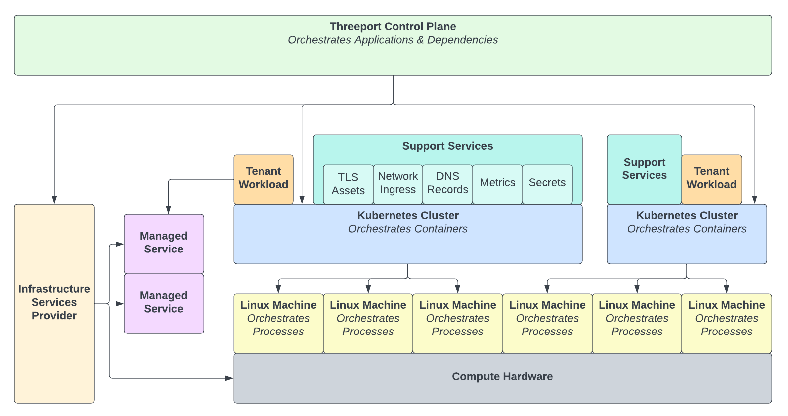

# Threeport

Threeport is an application orchestrator and software delivery control plane.

Threeport allows a user to define a workload and declare its dependencies.
Threeport orchestrates the delivery of the workload with all of those
dependencies connected and available.

Threeport provides an alternative to continuous delivery pipelines that use git
as the source of truth.  Threeport stores state in a database instead of git.
It uses software controllers that access the database and reconcile the desired
state to gracefully manage delivery.  This alleviates the need for sprawling
DevOps tools and config languages.

Threeport provides a unified, global control plane for workloads.  It is an
orchestration system for managing cloud provider infrastructure and the software
that uses it in any region, through a single, scalable control plane.

Threeport treats the following concerns as application dependencies:

* infrastructure
* container orchestration
* installed supporting services
* infra provider managed services

The Threeport control plane shown below consists of a RESTful API and a
collection of controllers that reconcile the state provided by users.  The
controllers perform reconciliation by interfacing with infrastructure service
provider APIs and the Kubernetes API.

## What Threeport Is Not

### Threeport is not a Kubernetes Distribution

Kubernetes distributions provide installation of Kubernetes clusters along with
supporting services, or cluster addons.  They provide a way to install
Kubernetes clusters that are ready to accept workloads.  The workflow is
generally as follows:

1. Platform engineers use the Kubernetes distro to install clusters and prepare
   them for use.
2. DevOps sets up CI/CD or GitOps pipelines to deploy into those clusters.
3. Developers push changes to config repos that trigger delivery of workloads to
   the clusters.

Threeport performs cluster install and preparation in response to application
deployments as needed.  The workflow is as follows:

1. Operations installs the Threeport control plane.
2. Operations creates dependency profiles that are not satisfied by the existing
   system defaults.  This could include profiles for clusters, managed services
   or installed supporting services.
3. Developers provide workload configs with dependency declarations to
   Threeport.  Threeport orchestrates the deployment of the application and its
   dependencies.

### Threeport is not a Continuous Integration System

Traditional CI includes automated testing and build processes for software.  The
existing tools and systems used by developers today for this are perfectly
adequate.  Threeport requires no change to these developer workflows.

In order to integrate Threeport, simply add a call to the Threeport control
plane to notify it of a new build of a container image at the end of your CI
process.  Threeport will perform the delivery of the new version into the
appropriate environment/s.

## Summary

Fundamentally, Threeport exists to reduce engineering toil and increase resource
consumption efficiency in delivering software to its users.  This leads to
greater development velocity as well as lowered engineering and infrastructure
costs.

It is designed and built upon the following principles:

* Workloads should not be platform aware.  Rather, platforms should be workload
  aware and provide application dependencies all the way down to the
  infrastructure when, and only when, they are needed by the workload.
* Sophisticated Kubernetes application platforms should be as easy to use as a
  developer workstations.
* Software supply chains should be API-driven and the persistence layer for
  configuration should be stored in a database rather than a git repo.  Software
  delivery is most reliably handled by level-triggered controllers rather than
  disparate toolchains.

If you'd like to try it out, visit our [getting started
guide](guides/getting-started/).

If you'd like to learn about the architecture, check out our [architecture
overview](architecture/overview/).

