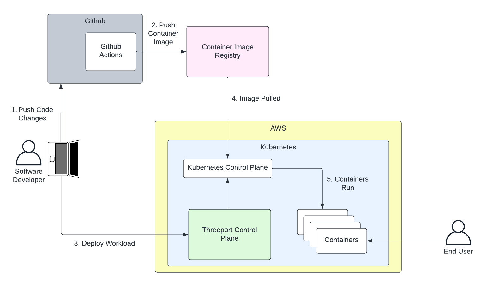
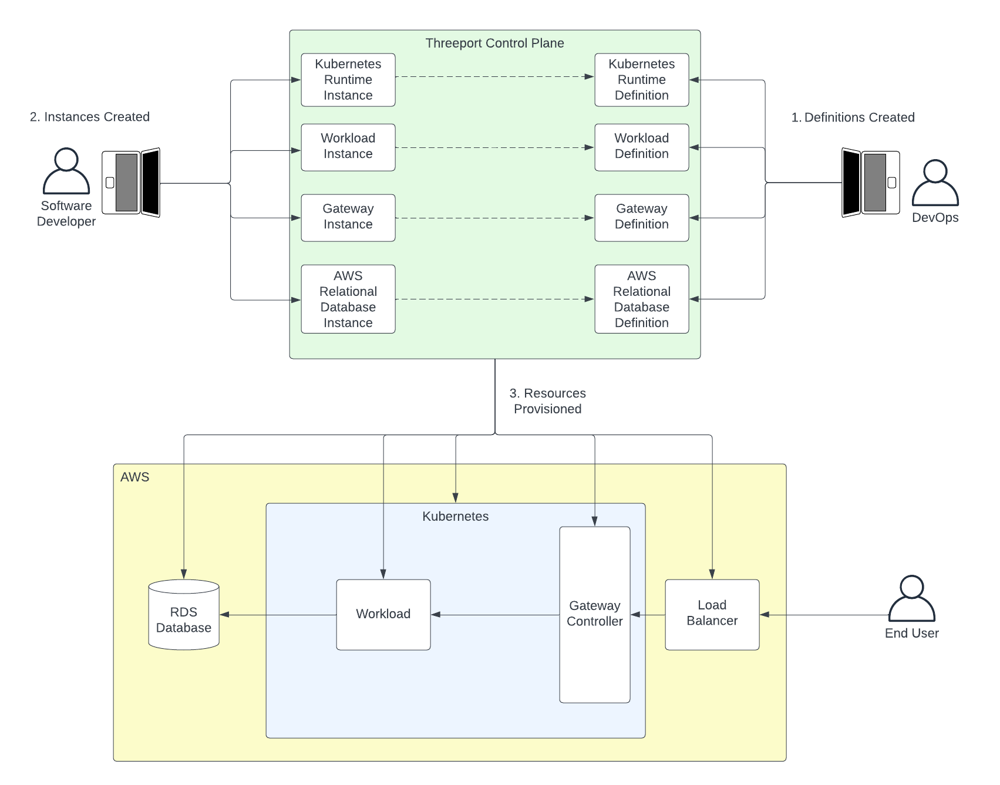
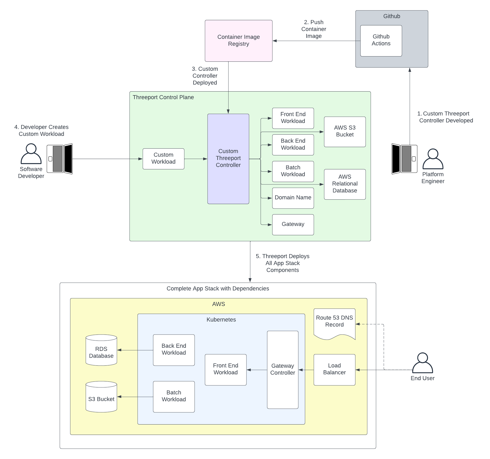

# Threeport

Threeport is an Application Orchestrator.

App Orchestration is the next evolution for software delivery.  For years we have used
continuous delivery pipelines and GitOps as methods for delivering software.  As
cloud native has become more ubiquitous, these methods have become increasingly
insufficient.

Threeport offers a self-service experience to developers.  The developer's
software delivery is facilitated by DevOps and platform engineering teams, but
does _not_ put those teams on the day-to-day critical delivery path for
applications.

Fundamentally, Threeport exists to reduce engineering toil, increase resource
consumption efficiency, and make the most complex software systems manageable by
relatively small teams.  This leads to the delivery of more feature rich and
more reliable software with lower infrastructure and engineering costs.

Better software.  Lower costs.

## Threeport for Developers

Threeport allows developers to deliver the apps they build to cloud native
environments.

Following is a common scenario for a developer workflow using Threeport:

0. Developer pushes code to GitHub.
0. The CI actions run (GitHub actions in this case) and produce a container image that is
   pushed to a registry such as Docker Hub or GitHub Container Registry.
0. The developer uses the Threeport CLI tool `tptctl` to install Threeport on AWS.
   It takes just one command to do so.  It will install an EKS cluster on AWS
   and install the Threeport control plane on it.
0. The developer uses `tptctl` to deploy their workload.  This makes a call to
   the Threeport API and triggers the control plane to deploy the app.
   Threeport will call the Kubernetes API to deploy the Kubernetes resources.
   If requested, Threeport can deploy AWS managed service dependencies as well
   as other support services to configure ingress routing from the internet,
   provision SSL certs, set DNS records, etc.
0. The image is pulled by the Kubernetes control plane.
0. The app runs in containers on the Kubernetes cluster.  This example shows
   the app running in the same Kubernetes environment as the Threeport Control
   Plane, but this is optional.  Threeport can deploy separate Kubernetes
   runtime environments as needed, and manage deployments to any cluster managed
   by Threeport.

## Threeport for DevOps

DevOps can streamline developer usage by creating definitions for the resources
developers need to deliver.  Most Threeport objects have two components: a
definition and instance.  The definition provides the configuration.  The
instance uses a small number of runtime parameters and references the definition
to spin up the resources required.  Learn more about definitions and instances
in [this document](concepts/definitions-instances.md).

Following is an example of this works:

0. DevOps creates the definition configurations that can be referenced later by
   developers.  Any number of definitions can be made available for different
   needs for each resource type.
0. The developer creates instances from these definitions to create a new
   Kubernetes runtime, if needed, service dependencies like network gateways,
   managed dependencies like RDS databases, as well as the workload itself.  The
   developer doesn't have to worry about any resource configuration since DevOps
   took care of this.  They only provide runtime parameters such as which
   Kubernetes runtime to use for their workload.
0. Threeport deploys the Kubernetes runtime and, if needed, the RDS database, the
   gateway controller along with its load balancer and the workload itself.  All
   dependencies are connected so that the workload is immediately available to
   the end user as soon as the resources are up.

## Threeport for Platform Engineers

Platform engineering can extend Threeport using the [Threeport
SDK](sdk/sdk-intro.md).  When an
organization has a high-value, complex workload, this approach is highly
recommended.  It provides maximum programmatic control of app delivery resulting
in greater capabilities, reliability and cost efficiency.  It also requires a
greater up-front engineering investment from the platform engineering team which
is why using this approach is optimal for sophisticated, revenue generating
applications.

The process for optimizing application delivery with platform engineering looks
something like this:

0. A platform engineering team uses the Threeport SDK to build extensions to the
   Threeport control plane.  This code for this extensions lives in its own
   git repo.  Experienced Go programmers with a sound understanding of
   Kubernetes and Threeport can usually produce a POC within a couple of weeks,
   even faster for simpler use cases.
0. The primary asset produced from the project's CI pipeline is a container
   image for the Threeport controller that understands the needs of the custom
   workload managed by a dev team.
0. The custom controller is deployed with the rest of the Threeport control
   plane.  Threeport is now extended to include intelligent management of
   instances of the custom workload.
0. The developers now use a custom object that requires much less configuration
   as the details of implementation are built into the custom Threeport
   controller.
0. When the custom workload is created, Threeport deploys all the components of
   the application, stitching all the components together to produce a running,
   available application as soon as all resources are provisioned.  In this
   example a front-end component is deployed with TLS termination and network
   ingress from the public internet plumbed through an AWS load balancer.  The
   back end workload is deployed and connected to a new AWS RDS database that is
   also spun up by Threeport.  A batch workload is deployed with a new S3 bucket
   for assets to be processed.  DNS records are created in a Route53 hosted zone
   to provide a domain name for connection to the load balancer's IP.

## Managed Threeport

Threeport itself is a complex distributed software system that is trivial to
deploy for testing and development, but non-trivial to manage, upgrade, maintain
and troubleshoot when problems arise.

[Qleet](https://qleet.io/) is currently the only service provider that offers
fully managed Threeport control planes.  The originators, developers and
maintainers of the Threeport project are on the engineering team at Qleet.

